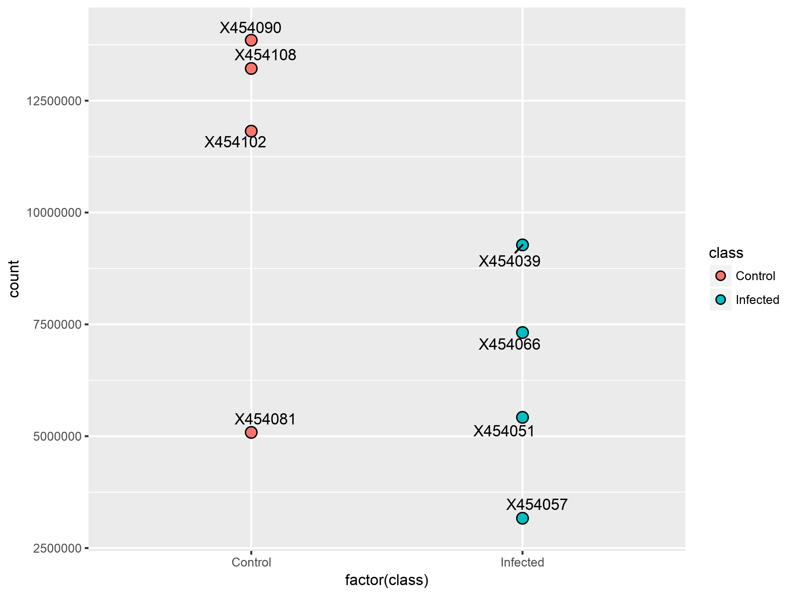
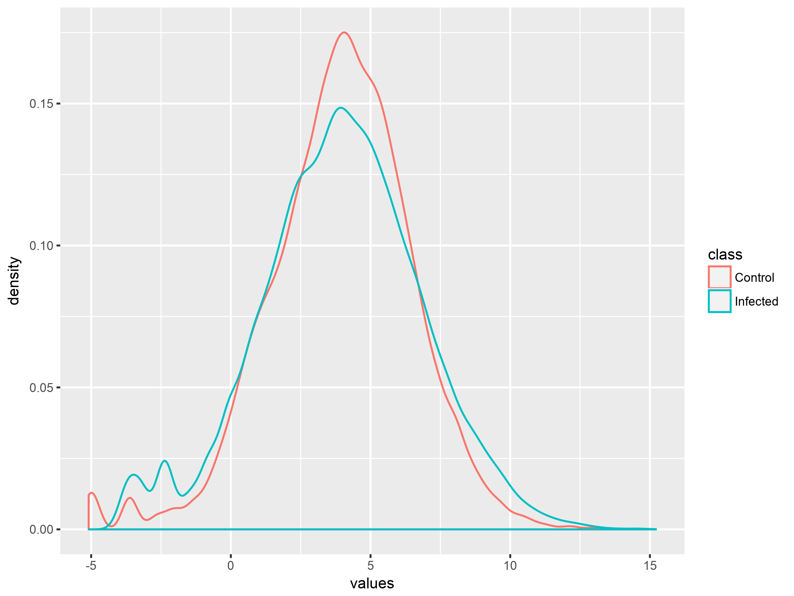

# Other Descriptive Tools

The following Count figure is a diagnostic tool that gives the total count of each sample in treatment and control groups. As we can see, the control group is having a higher counts than the treatment cases, which would indicate a source of bias. The depth (total counts) of different types is expected to be very similar.

The Density plot summarizes the distribution of experimental groups and helps in realizing differences between them. It is a quality check tool to make sure that certain treatment holds an effect. In the following figure, we see that both experimental groups follow generally the same distribution but with difference in the middle indicating a desired variability. In such case, the plot confirms that data is informative.

In the following image, the plot helps in looking at the distribution of up-regulated and down-regulated samples (see [volcano plot](background_volcano.md)).

