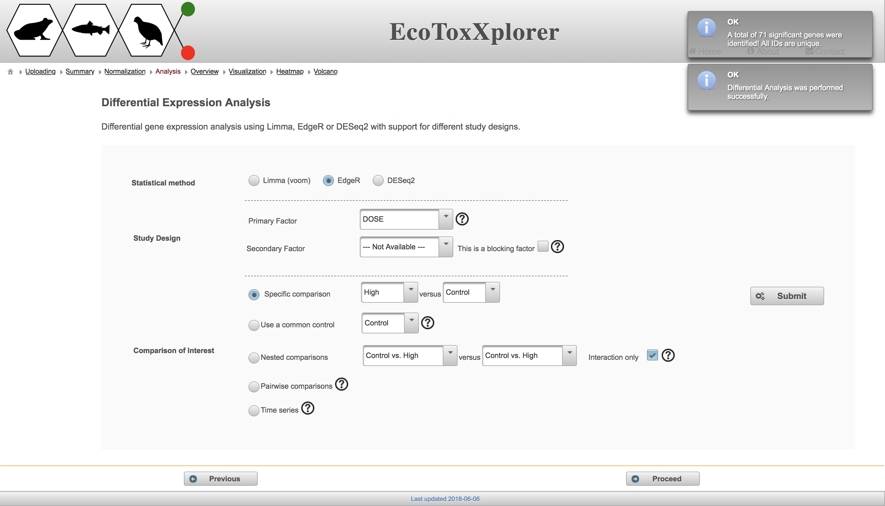

# Differential Expression Analysis

The goal of differential expression analysis is to identify genes that are up or down regulated in treated samples in comparison to the controls. The analysis involves fitting some statistical model to the data, specifying the class label (factor) that will be used to distinguish groups of samples, and specifying the comparisons of interest between different sample groups. These three steps correspond to the three sections on the EcoToxXplorer "Differential Expression Analysis" page:

There are three different methods available for fitting statistical models in the "Statistical method" section, all of which are well established. In the "Study Design" section, users can choose the primary factor from a drop down menu, and a secondary factor if applicable (dose is the only factor in this example dataset, but other factors could be life stage or chemical in a more complex dataset from the EcoToxChip project). The most common comparison is the "Specific comparison" in which one group is compared to a second group, but you can test out the different methods to see the resulting number of differentially expressed genes. Note that the "Time series" comparison does not make sense here because all of the doses have the same time point. If you'd like to learn more about the factors and specific comparisons, hover over the circled question mark beside each feature. Once you've made your selections, click "Submit" and a box will temporarily appear with the number of differentially expressed genes:

You can redo the differential expression analysis using a different method or comparison by selecting different options and then clicking "Submit" again. Once you are done, click the "Proceed" to move on to visualize the results of the differential expression analysis. 

### Next step: [Volcano Plot Tool](rnaseq_volcano.md)
### Previous step: [Data Filtering & Normalization](rnaseq_filtering.md)
