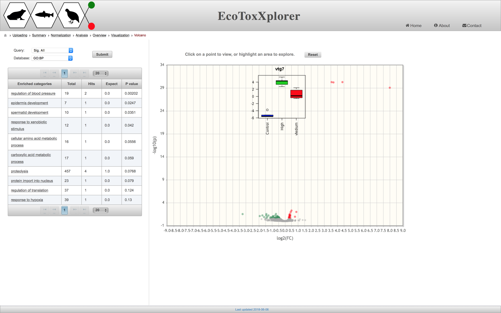

# Volcano Plot Tool

Please refer to the background section for details on [volcano plot](background_volcano.md). After finishing the main steps for uploading and normalizing the RNAseq data for the Minnow (ethinylestradiol) example, several tools can be used to examine results. The volcano plot as illustrated in the following figures would highlight the set of up-regulated and down-regulated genes.

The volcano plot tool in EcoToxXplorer is interactive. Therefore, users can choose any point in the plot and see a subplot that reflects the levels of changes for that gene under different conditions. In the following figure, the [vtg7 gene](https://www.ncbi.nlm.nih.gov/gene/?term=vtg7) is selected as one of the top up-regulated (i.e. red colored genes) at the top of the volcano plot. The boxplot is interactively updated for this gene and shows clear difference in expression of high dose vs. control.

In the volcano plot tool, it easy to zoom in and out and select certain view or group of genes to update the [GSEA](ackground_gsea.md). As the following figure, only a group of down-regulated genes were selected. Then, the "Query" option for GSEA analysis is set to "Current View" which means to consider only the zoomed view for the enrichment analysis. The user can click submit and an updated version of the enrichment results will appear in the table. Also, the GSEA functionality provides "Query" option to select either all up-regulated or down-regulated genes.

### Next step: [Heatmap Tool](heatmap_tool.md)
### Previous step: [Differential Expression Analysis](rnaseq_DEG.md)
